# 智能 RAG 平台 — 架构与原理学习指南

> 面向学习：梳理**重要代码文件**、**技术选型**，并用 Mermaid 给出架构图 / 流程图 / 输入输出流 / 时序图，并剖析核心概念与原理。  
> 配套快速启动见根目录 [`README.md`](../README.md)、部署见 [`部署说明.md`](./部署说明.md)。

---

## 目录

1. [系统在解决什么问题](#1-系统在解决什么问题)
2. [技术栈与职责](#2-技术栈与职责)
3. [重要代码文件地图](#3-重要代码文件地图)
4. [架构图](#4-架构图)
5. [核心流程图](#5-核心流程图)
6. [输入输出数据流](#6-输入输出数据流)
7. [时序图](#7-时序图)
8. [概念与原理剖析](#8-概念与原理剖析)
9. [本地学习路径建议](#9-本地学习路径建议)

---

## 1. 系统在解决什么问题

传统大模型「只靠参数记忆」容易幻觉、无法回答企业私有文档。本平台走 **RAG（Retrieval-Augmented Generation，检索增强生成）**：

1. 把企业文档切成片段并向量化存入向量库；
2. 用户提问时先**检索**相关片段；
3. 把片段作为上下文交给 LLM **生成**答案。

同时提供：双角色登录（管理员 / 员工）、知识库与权限、白标品牌、命中率测试、可观测（Langfuse / Prometheus）。

---

## 2. 技术栈与职责

| 层级 | 技术 | 本项目中的职责 |
|------|------|----------------|
| 前端框架 | Vue 3 + Vite | SPA、组件化页面 |
| 路由 / 状态 | Vue Router + Pinia | 登录守卫、token / 品牌 / 会话状态 |
| UI | Element Plus | 表单、表格、布局组件 |
| HTTP | Axios | 统一请求封装、Bearer Token |
| 后端框架 | FastAPI + Uvicorn | REST API、依赖注入鉴权、后台任务 |
| ORM / DB | SQLAlchemy + SQLite | 用户、KB、文档元数据、Chunk 文本、会话 |
| 向量库 | Chroma（HttpClient） | 存 embedding，按 `kb_id` 过滤相似度检索 |
| 切分 | langchain-text-splitters | 固定窗口 + overlap 分块 |
| 关键词检索 | jieba + rank-bm25 | 中文分词 + BM25，与向量做混合检索 |
| LLM / Embedding | OpenAI 兼容 API（可接百炼） | 回答生成、文本向量化 |
| 鉴权 | PyJWT + passlib/bcrypt | 登录签发 JWT、密码哈希 |
| 可观测 | Langfuse、Prometheus、loguru | Trace、指标、结构化日志 |

**端口约定**：前端 `5173` · 后端 `8001` · Chroma `8000`。

---

## 3. 重要代码文件地图

### 3.1 后端（`backend/app/`）

| 路径 | 为什么重要 |
|------|------------|
| `main.py` | 应用入口：挂路由、CORS、上传静态目录、启动建表种子 |
| `config.py` | 从 `.env` 读配置：模型、Chroma、切片参数、JWT |
| `api/auth.py` | 登录、当前用户 |
| `api/docs.py` | 上传文档并触发后台 `ingest` |
| `api/chat.py` | 对话发送 / 流式 SSE、会话 CRUD |
| `api/rag.py` | 命中率测试（只检索不生成） |
| `api/kb.py` / `user_groups.py` | 知识库与组授权 |
| `api/branding.py` | 白标读写 |
| `rag_engine/ingest.py` | 入库管线总控 |
| `rag_engine/splitter.py` | 文本切块 |
| `rag_engine/embedder.py` | Embedding + 写入/查询/删除 Chroma |
| `rag_engine/retriever.py` | vector / keyword / hybrid |
| `rag_engine/query_rewrite.py` | 多轮问句改写 |
| `rag_engine/generator.py` | 基于片段生成答案（含流式） |
| `rag_engine/rag_pipeline.py` | rewrite → retrieve → generate 串联 |
| `db/models.py` | 领域模型：User、KB、Document、Chunk… |
| `utils/auth.py` / `permission.py` | JWT、KB 访问控制 |
| `utils/llm_client.py` | 统一 LLM HTTP 客户端 |

### 3.2 前端（`frontend/src/`）

| 路径 | 为什么重要 |
|------|------------|
| `main.js` | 挂载 Vue、Pinia、Router、Element Plus |
| `router/index.js` | `/login` 与后台路由；未登录重定向；角色菜单 |
| `views/Login.vue` | 登录页 UI + 登录弹窗（品牌落地） |
| `views/Layout.vue` | 管理端壳：侧栏 / 顶栏 / 白标 |
| `views/ChatDialog.vue` | 智能对话主界面 |
| `views/DocManage.vue` / `KbManage.vue` | 文档与知识库管理 |
| `stores/user.js` | token / 用户信息 |
| `stores/branding.js` | 白标缓存与 `applyBranding()` |
| `stores/chat.js` / `kb.js` / `doc.js` | 业务状态 |
| `api/*.js` + `utils/request.js` | 接口层与 Axios 拦截器 |
| `styles/login.css` / `variables.css` | 登录页 Token（`--login-*`） |

### 3.3 脚本与配置

| 路径 | 作用 |
|------|------|
| `scripts/start_all.bat` / `.sh` | 一键起 Chroma → 后端 → 前端 |
| `scripts/stop_all.bat` / `.sh` | 停止服务 |
| `scripts/init_db.py` | 初始化 SQLite + 种子账号 |
| `.env` / `.env.example` | `ENV`、DB 名、Chroma 后缀、API Key、模型名等 |

---

## 4. 架构图

### 4.1 总体逻辑架构

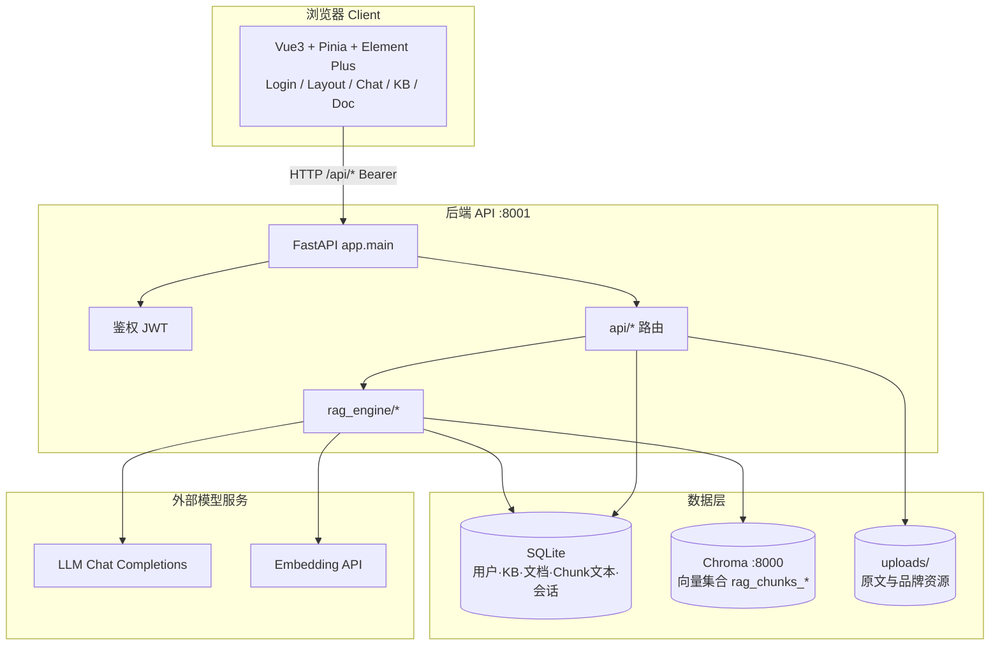

### 4.2 前后端模块依赖（简化）

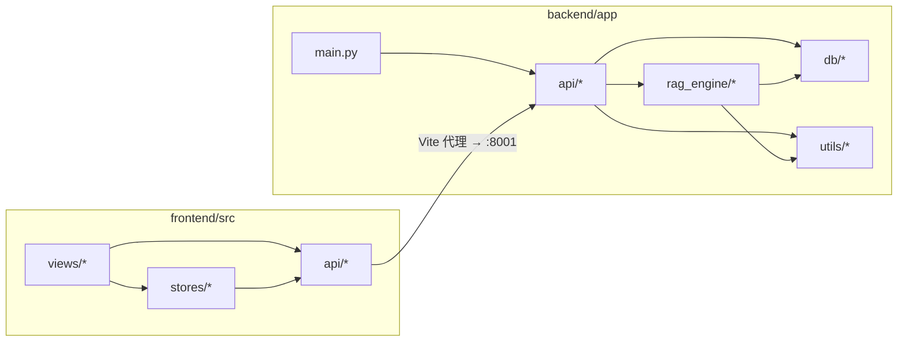

### 4.3 RAG 引擎内部结构

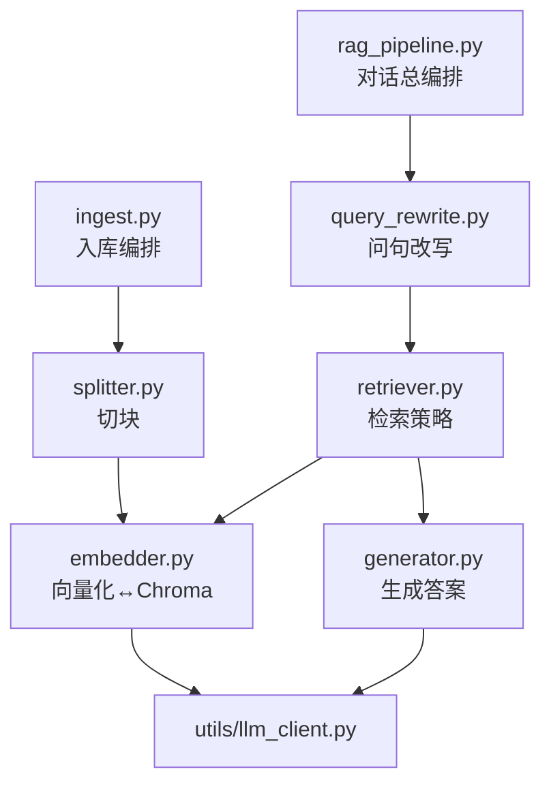

---

## 5. 核心流程图

### 5.1 用户使用主路径

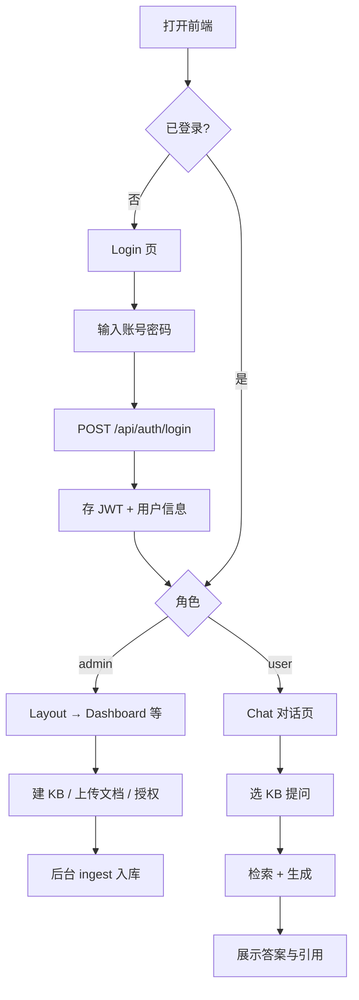

### 5.2 文档入库流程

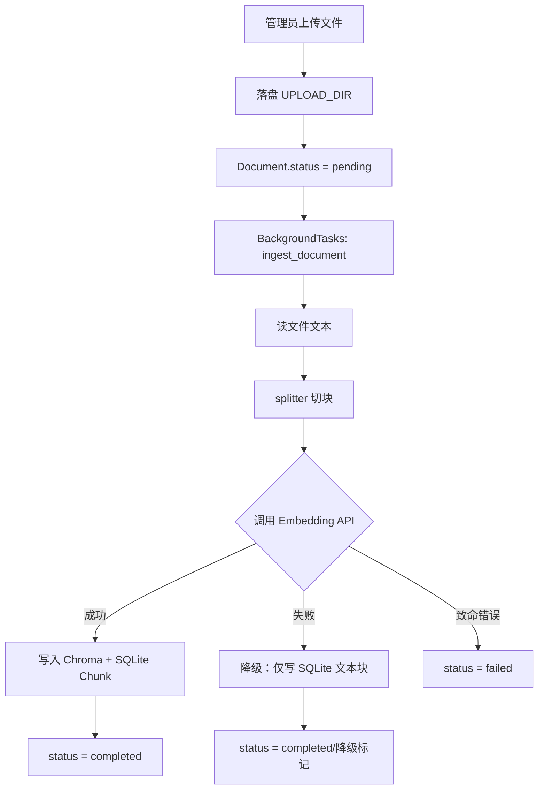

### 5.3 检索策略分支

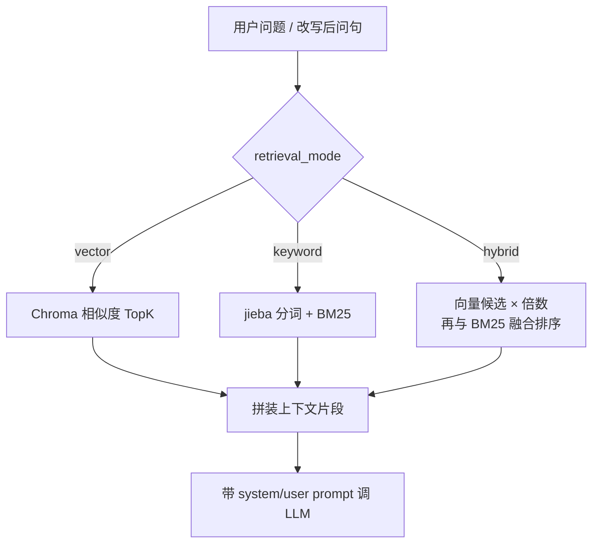

---

## 6. 输入输出数据流

### 6.1 登录

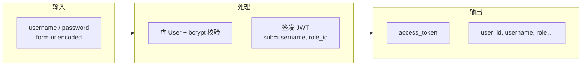

### 6.2 文档入库

| 阶段 | 输入 | 输出 |
|------|------|------|
| 上传 API | `multipart` 文件 + `kb_id` + Token | `document_id`，状态 pending |
| 切块 | 原文文本、`CHUNK_SIZE/OVERLAP` | `List[chunk_text]` |
| Embedding | chunk 文本列表 | 向量列表（维度由模型决定） |
| 持久化 | 文本 + 向量 + metadata(`kb_id`,`doc_id`) | SQLite `chunks` + Chroma ids |
| 终态 | — | `Document.status` completed / failed |

### 6.3 对话问答

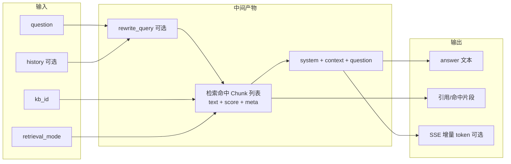

### 6.4 双存储分工（务必理解）

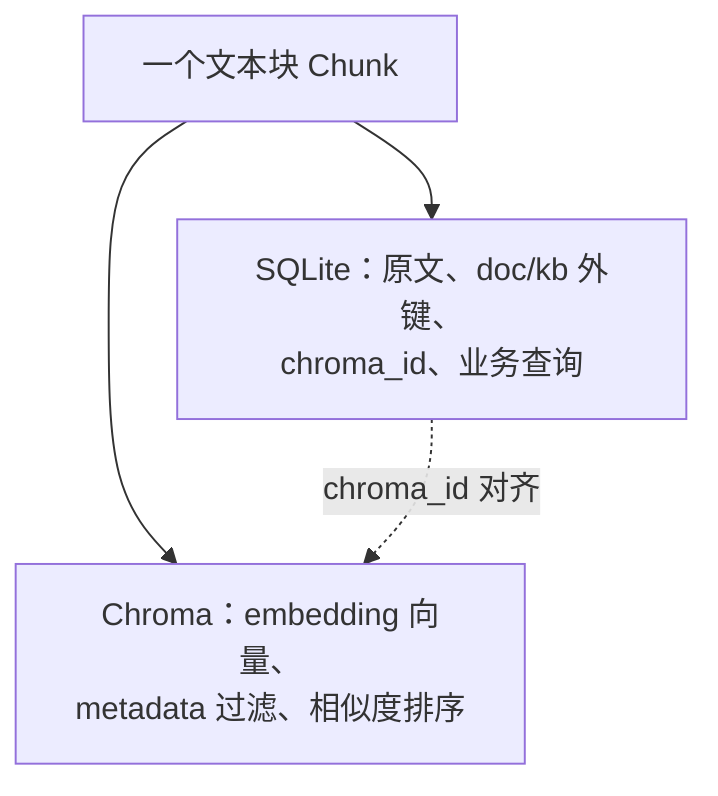

**原理**：关系库擅长结构化与事务；向量库擅长「语义相近」的近邻搜索。两边用 `chroma_id` / metadata 对齐，删文档时必须**两边一起清**，否则会出现「库里有文、检索幽灵」或「检索有、正文无」。

---

## 7. 时序图

### 7.1 登录与进入系统

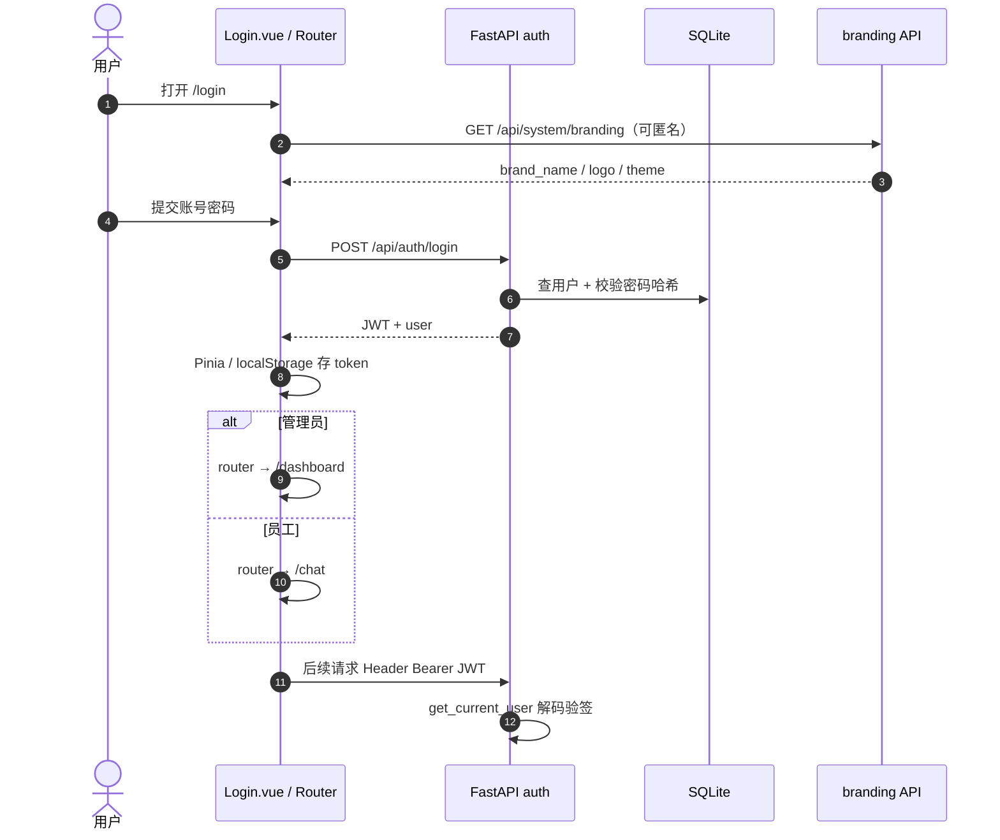

### 7.2 上传文档 → 异步入库

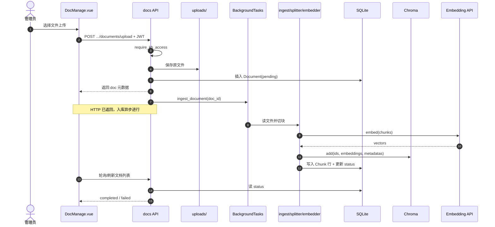

### 7.3 智能对话（含可选流式）

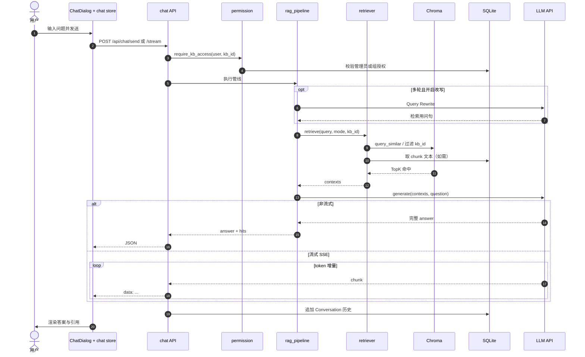

---

## 8. 概念与原理剖析

### 8.1 什么是 Embedding？

- 把文本映射到高维向量空间，使**语义相近**的句子距离更近。
- 检索时用「问题向量」与「块向量」比相似度（本项目 Chroma 侧常用余弦一类度量）。
- **注意**：Embedding 模型与维度必须前后一致；换模型往往要**重建向量库**。

### 8.2 为什么要切块（Chunking）？

- LLM 上下文窗口有限；整本手册塞不进 prompt。
- 过长块噪声大，过短块丢上下文。本项目用固定长度 + **overlap（重叠）**，降低「答案落在切缝上」被劈开的风险。
- 配置一般在 `config.py`：`CHUNK_SIZE` / `CHUNK_OVERLAP`（如 500/50 量级）。

### 8.3 向量检索 vs 关键词检索 vs 混合

| 模式 | 擅长 | 局限 |
|------|------|------|
| vector | 同义改写、语义相近 | 专有名词、精确编号可能弱 |
| keyword (BM25) | 专名、编号、字面命中 | 换一种说法易漏 |
| hybrid | 两者互补 | 要调权重与候选倍数 |

**原理一句话**：语义召回 + 字面召回，再融合排序，更稳。

### 8.4 JWT 鉴权在做什么？

1. 登录成功后服务器用密钥签发**自包含令牌**（payload 含用户标识、角色等）。
2. 浏览器每次请求带上 `Authorization: Bearer ...`。
3. 后端验签、查用户是否仍启用，再执行业务。
4. **KB 权限**是第二道门：即使登录了，没有组授权也不能搜该库（`require_kb_access`）。

### 8.5 为什么对话要「先检索再生成」？

- 生成模型的知识截止于训练数据，且易编造。
- RAG 把「可引用的证据」放进 prompt，答案可追溯到 Chunk / 文档。
- 命中率测试（`/api/rag`）单独测检索质量，便于调 `hybrid` 与切块，而不被生成文采干扰。

### 8.6 Query Rewrite 的意义

多轮对话里用户常说「那第二个呢」「刚才那个接口的超时参数」。  
改写模块把指代消解成**独立可检索问句**，再去向量库搜，避免检索词过短或指代不明。

### 8.7 环境隔离（多人同机）

通过 `.env` 中的：

- `ENV` / `LOCAL_DB_NAME` → 各自 SQLite 文件  
- `CHROMA_COLLECTION_SUFFIX` → 各自向量集合  
- `UPLOAD_DIR` → 各自上传目录  

避免同学之间互相覆盖数据。这是工程协作上的重要设计，不只是「配置项」。

### 8.8 前端分层心智模型

```
视图 Views（只关心展示与交互）
    ↓ 调
Stores（跨页状态：token、当前 KB、会话）
    ↓ 调
API 模块（路径与参数）
    ↓
request.js（统一 baseURL、Token、错误 Toast）
```

登录页 `Login.vue` 主要负责**品牌落地 + 登录浮窗**；进系统后的壳是 `Layout.vue`。按《UI双人开工协议》登录侧与后台侧可并行改 UI，但不要改 `api` / `router` 契约。

### 8.9 流式输出（SSE）在原理上是什么？

- 非流式：等 LLM 整段生成完再返回 JSON。
- 流式：服务端用 **Server-Sent Events** 持续推送 token，前端边收边渲染，降低体感延迟。
- 后端仍要在流结束后落库完整回答。

---

## 9. 本地学习路径建议

建议按下面顺序读代码并对照上文图：

1. **跑通**：`scripts/start_all.*` → 浏览器打开前端 → `admin / admin123` 登录。  
2. **鉴权**：`frontend/src/utils/request.js` → `backend/app/api/auth.py` → `utils/auth.py`。  
3. **入库**：上传一篇短 Markdown → 跟 `api/docs.py` → `rag_engine/ingest.py` → Chroma。  
4. **检索**：命中率测试页 + `retriever.py`，对比 vector / keyword / hybrid。  
5. **生成**：`ChatDialog.vue` → `chat.py` → `rag_pipeline.py` → `generator.py`。  
6. **权限**：建用户组、授权 KB，用员工账号验证「看不见未授权库」。  
7. **白标**：品牌配置 → `branding` store → Login / Layout 展示。

### 默认账号（初始化后）

| 角色 | 用户名 | 密码 |
|------|--------|------|
| 管理员 | admin | admin123 |

---

## 附录：一张总览「从文件到答案」

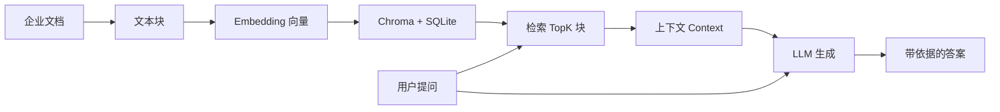

---

*文档版本：与仓库 `rag-platform` 教学用途同步整理。若接口细节有出入，以 `docs/api_contract.md` 与源码为准。*
